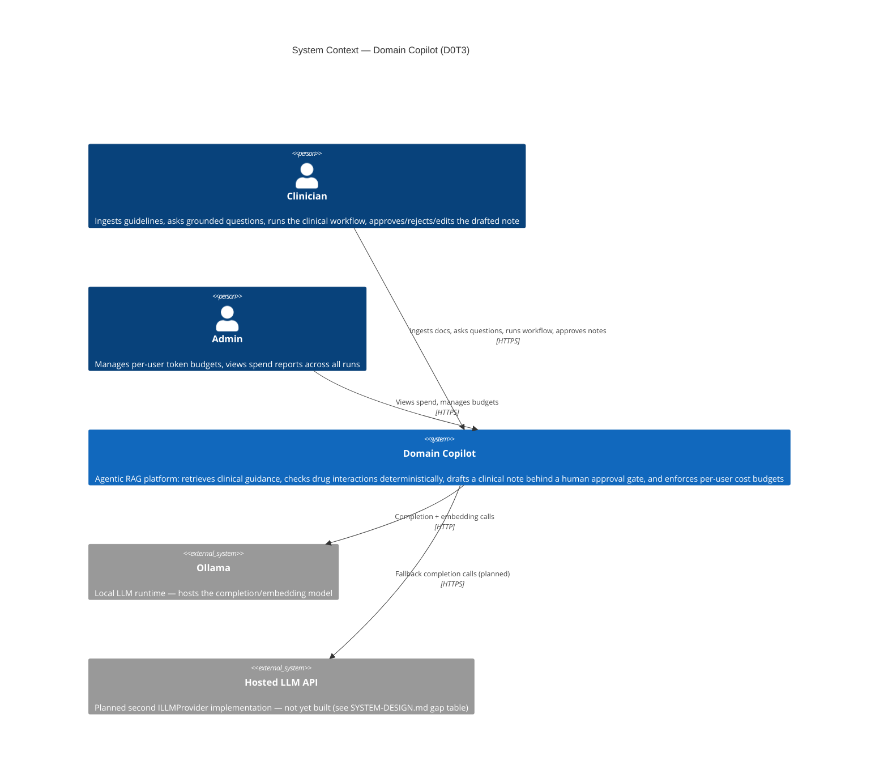
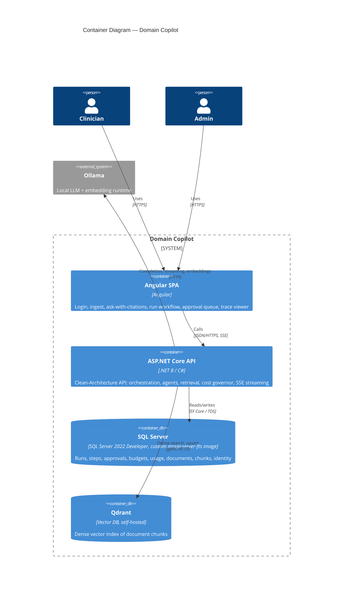
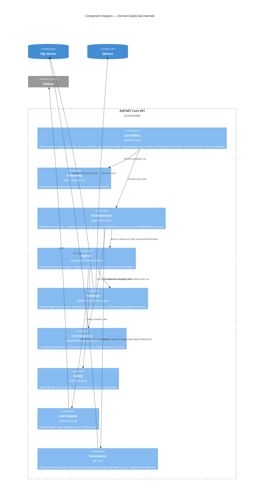
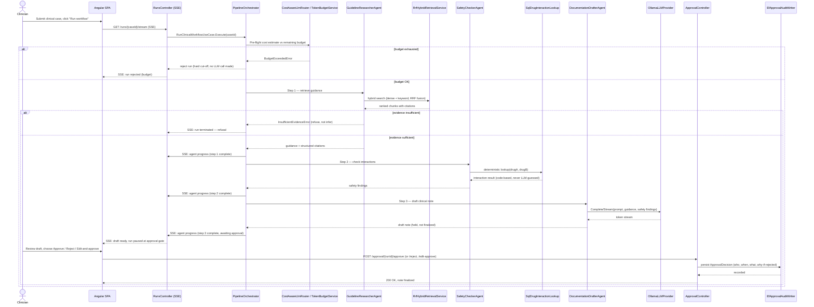
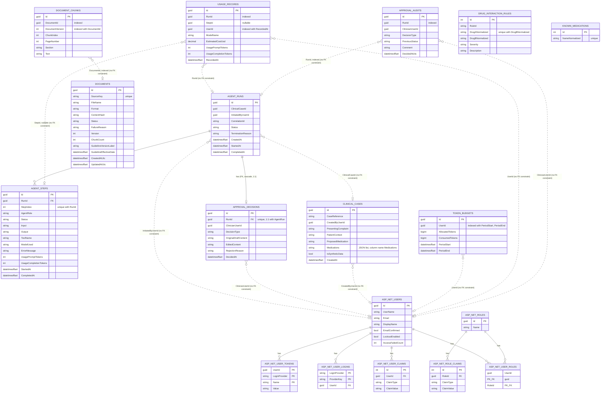
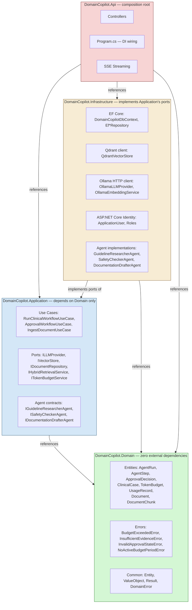

# Architecture — Domain Copilot (D0T3: Healthcare / Cost Governor)

All diagrams below are Mermaid source, committed as text (not only rendered images), per
the assignment's requirement. Render them with any Mermaid-compatible viewer (GitHub renders
them natively in `.md` files).

Where a relationship in the ER diagram is a plain Guid column rather than an enforced EF Core
`HasForeignKey`, it's drawn with a dashed line and labelled "no FK constraint" — this is
accurate to `DomainCopilotDbContextModelSnapshot.cs` as it stands today, not an assumption.

---

## 1. C4 Level 1 — System Context



---

## 2. C4 Level 2 — Container Diagram



---

## 3. C4 Level 3 — Component Diagram (API internals)



---

## 4. Sequence Diagram — Full Clinical Workflow (streaming + approval gate)



---

## 5. ER Diagram — SQL Server Schema

Derived from `DomainCopilotDbContextModelSnapshot.cs`. Dashed relationships (`..`) are
columns that exist and are indexed/queried against, but have **no EF Core `HasForeignKey`
constraint** as of the current snapshot — worth noting honestly rather than drawing them as
enforced, and worth a line in `docs/SECURITY.md` / a follow-up ADR on whether that's an
intentional Clean-Architecture boundary (Domain/Application not referencing
`ApplicationUser`, which lives in Infrastructure/Identity) or a gap to close with a value
converter + owned reference.



### Honest note on this schema

Two things worth stating plainly in `docs/SYSTEM-DESIGN.md` or a short ADR, since they're
real properties of the current model, not oversights to hide:

1. **Referential integrity for cross-aggregate references (`UserId`, `ClinicalCaseId`, etc.)
   is enforced in application code, not the database.** This is a defensible Clean
   Architecture choice — `DomainCopilot.Domain` doesn't reference
   `DomainCopilot.Infrastructure.Identity.ApplicationUser` — but it does mean a bad write
   path could insert an orphaned `UserId` that the database itself won't reject. Worth
   naming as an accepted trade-off, not silently leaving it undocumented.
2. `DocumentChunk.DocumentId` has no enforced FK either, despite `Document` being in the
   same bounded context (`DomainCopilot.Domain.Ingestion`). That one's harder to justify as
   an architectural boundary and is worth either fixing (a straightforward migration) or
   explaining as a deliberate performance/ingestion-throughput trade-off if that's the real
   reason.

---

## 6. Layer-Dependency Diagram



**How to actually verify this, not just claim it:** `Domain` has no outgoing arrow in the
diagram above because nothing in `DomainCopilot.Domain.csproj` should reference EF Core, the
Qdrant client, an HTTP client, or ASP.NET Core. Run this to check it yourself before citing
the diagram as fact:

```bash
cat src/DomainCopilot.Domain/DomainCopilot.Domain.csproj
```

If that file has zero `<PackageReference>` entries beyond the bare SDK, the diagram is
accurate. If it has any, the diagram (and the acceptance test in Section 3 of the brief) is
currently wrong and should say so.
